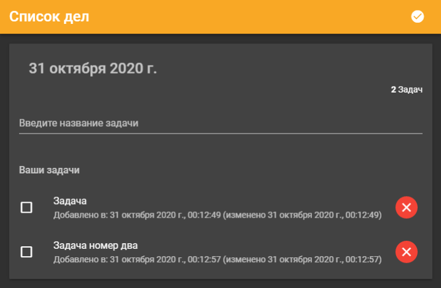

[](https://page-keep.herokuapp.com/)
___
## Установка проекта
Подключить `git` репозиторий.
```
$ git remote add origin https://github.com/Egoka/PageKeep.git
```
Установить зависимости из файла `package.json`
```bash
$ npm install
```
Запустить сервер по адресу [`http://localhost:3000`](http://localhost:3000)
```bash
$ npm start
```
___
## Описание проекта
Приложение для составления заметок.
Для составления новой заметки необходимо добавить ее в поле ввода.
Созданные заметки можно отмечать как выпаленные или возвращать как которую еще предстоит выполнить.
Заметки которые уже не нужны можно удалять из памяти.


